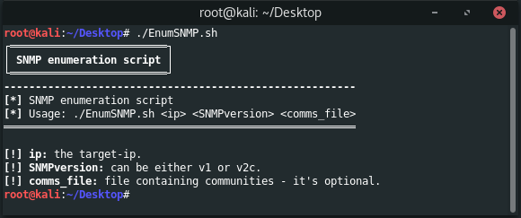

 

* * *
__EnumSNMP__ is a simple shell script to automate the process of enumerating SNMP. The SNMP version can be either v1 or v2c.

>EnumSNMP enumerates:

*   User accounts
*   Running processes
*   TCP local ports
*   Installed software

**Requirements:**

*   [snmpwalk](https://linux.die.net/man/1/snmpwalk)
*   [onesixtyone](https://github.com/trailofbits/onesixtyone)

### Disclaimer
> This tool is only for testing and academic purposes and can only be used where strict consent has been given. Do not use it for illegal purposes! It is the end user’s responsibility to obey all applicable local, state and federal laws. Developers assume no liability and are not responsible for any misuse or damage caused by this tool and software.

## Credits

*   Logo designed with [fontmeme.com](https://fontmeme.com/graffiti-fonts/)!

## License

This project is licensed under the GPLv3 License - see the [LICENSE](LICENSE) file for details